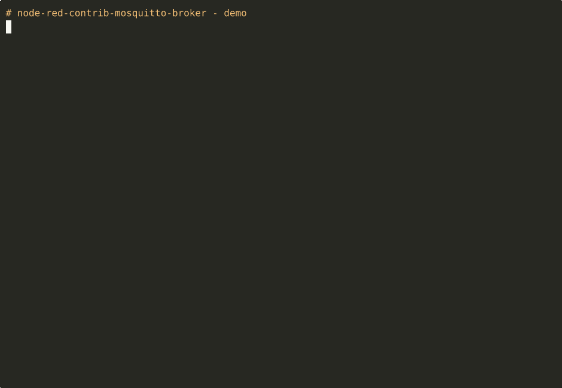

# node-red-contrib-mqtt-broker

A Node-RED node that runs a **Mosquitto MQTT broker** as a child process of
Node-RED. A deploy starts the broker; a redeploy or shutdown stops it cleanly.
The module ships with an auto-installer for the underlying binary — Linux,
macOS, and Windows 10/11.



---

## Features

- **Mosquitto is installed automatically** (apt/dnf/yum/zypper/pacman/apk on
  Linux, Homebrew on macOS, winget/choco/direct download on Windows).
- **Self-heal**: if the binary is missing at first deploy, the installer runs
  again interactively — important on Windows, where the UAC prompt cannot
  surface during the palette manager's `npm install`.
- **Full broker control via messages**: `start`, `stop`, `restart`, `status`,
  `install`.
- **Topic inspection**: `topics` lists every topic name the broker has seen;
  `get` returns the last value of a topic together with raw bytes, QoS, and
  timestamp.
- **UI-configurable**: port, bind address, anonymous access, persistence,
  username/password, optional custom `mosquitto.conf`.
- Emits broker logs as Node-RED messages (`mosquitto/stdout`,
  `mosquitto/stderr`).
- **Auto-restart** on unexpected exit (5 s backoff).

---

## Installation

### Via the Node-RED palette (recommended)

1. In Node-RED: ☰ → **Manage palette** → **Install** tab.
2. Search for `node-red-contrib-mqtt-broker` → **Install**, OR
3. Use the upload icon to install the `.tgz` from `dist/`.

The post-install runs in the background and installs Mosquitto. If it fails
(for example, UAC denied), the install is retried on first deploy — see
Self-heal.

### From the command line

```bash
cd ~/.node-red
npm install node-red-contrib-mqtt-broker
# Linux: requires root or passwordless sudo
# Windows: winget installer runs per-user first (no UAC prompt)
```

### Controlling the installer

| Variable | Effect |
|---|---|
| `SKIP_MOSQUITTO_INSTALL=1` | Skip the post-install step |
| `MOSQUITTO_WIN_VERSION=2.0.20` | Pin the installer version used by the Windows direct-download fallback |

Re-run the installer on demand:
```bash
npm run install-mosquitto    # from the module directory
```

---

## Configuration fields

| Field | Default | Description |
|---|---|---|
| Port | `1883` | Listen port |
| Bind | _(empty)_ | IP to bind; empty = all interfaces |
| Allow anonymous | `true` | Allow clients without credentials |
| Persistence | `false` | Mosquitto persistence in a temporary directory |
| Username / Password | — | Optional; the password file is hashed via `mosquitto_passwd` |
| Binary | _(empty)_ | Path to `mosquitto`/`mosquitto.exe`; empty = auto-lookup |
| Config file | _(empty)_ | Custom `.conf`; overrides every field above |
| Log to Node-RED console | `false` | Also surface broker logs in the Node-RED log |

---

## Input commands

Payload as a string or as an object `{ command: "…", … }`.

| Command | Description | Output topic |
|---|---|---|
| `start` | Start the broker | — |
| `stop` | Stop the broker | — |
| `restart` | Restart the broker | — |
| `status` | Report runtime state | `mosquitto/status` |
| `install` | Re-run the auto-installer | `mosquitto/install` |
| `topics` | Sorted list of every topic seen | `mosquitto/topics` |
| `get` | Last value for a single topic | `mosquitto/get` |

**Examples:**
```js
// List all topics
msg.payload = "topics";

// Fetch a topic value - either form works
msg.payload = { command: "get", topic: "sensors/temp" };

msg.topic = "sensors/temp";
msg.payload = "get";
```

---

## Output messages

| `msg.topic` | `msg.payload` |
|---|---|
| `mosquitto/stdout` | stdout line from the broker |
| `mosquitto/stderr` | stderr line |
| `mosquitto/status` | `{ running, port, bind, binary }` |
| `mosquitto/install` | `{ ok, binary }` |
| `mosquitto/topics` | `string[]` — topic names, sorted |
| `mosquitto/get` | `{ topic, found, value, buffer, qos, retain, timestamp }` |

`value` is the UTF-8 decoded payload; `buffer` is the raw `Buffer` (for binary
payloads).

**MQTT note on the `retain` flag:** `retain=true` is only set on messages
delivered to a fresh subscriber (historical delivery). Live messages always
arrive with `retain=false`, even when published with `-r` — that's standard
MQTT behaviour, not a bug in this node.

---

## Example flow

A ready-made flow lives at [`examples/mqtt-broker.json`](examples/mqtt-broker.json).
It starts the broker, sends `status` via an Inject node, and prints the
response in the Debug panel.

For topic inspection, wire a second Inject with `payload=topics` or
`payload={command:"get",topic:"sensors/temp"}` into the same broker node.

---

## Development

```bash
# End-to-end test against a real Mosquitto instance
npm test

# Re-record the terminal demo and render the GIF
npm run demo          # requires asciinema + agg
```

The integration test boots the broker through a minimal RED mock,
publishes/subscribes with `mosquitto_pub`/`mosquitto_sub`, exercises
`topics` + `get`, and verifies a clean shutdown.

---

## Troubleshooting

| Symptom | Cause & fix |
|---|---|
| Status **red**, "spawn error ENOENT" | Binary not installed. Send `install` as a message, or run `npm run install-mosquitto`. On Windows: accept the UAC prompt. |
| Status **red**, "port 1883 in use" | Another broker is already running (often the system service). Change the port, or stop the service (`sudo systemctl stop mosquitto`). |
| `topics` stays empty | The internal tracking client needs a moment to connect. Publish first, then query after ~1 s. |
| Auth test fails | `mosquitto_passwd` is missing, so the password file was not hashed. Install the `mosquitto-clients` package. |

---

## License

This project is licensed under the Apache-2.0 License - see the LICENSE file for details.

## Author

Created by boehand using Claude Opus 4.7

---

For issues and feature requests, please file an issue on the GitHub repository.
